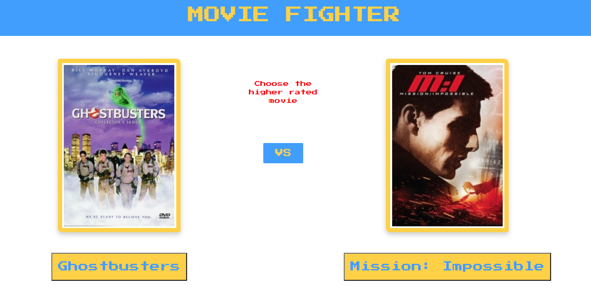

# Movie Fighter
<p>
  
  <a href="https://github.com/Ebyrd10/burgers_taskmaster#readme" target="_blank">
    
  </a>
  <a href="https://github.com/Ebyrd10/burgers_taskmaster/graphs/commit-activity" target="_blank">
    
  </a>
</p>

Movie Fighter is a fun web app where the user selects a parameter and has to guess which of two movies has more. Whether its highest box office, longest run time, or higher critic score, the answer may suprise you!



## Installation

```sh
clone the repo and open it up!
```

## Technology
* HTML
* CSS
* jQuery
* Bootstrap
* Async Await
* JavaScript ES6+ 
* Third Party APIs
* Local Storage

## Meet the Team

| **Ethan Byrd**| **Jenelle Langford**| **William Rave**|
| :---: |:---:| :---:|
| [](http://github.com/Ebyrd10)    | [](http://github.com/jenellelangford)    | [](http://github.com/AvianOverlord) |
| <a href="http://github.com/Ebyrd10" target="_blank">`github.com/Ebyrd10`</a> | <a href="http://github.com/jenellelangford" target="_blank">`github.com/jenellelangford`</a> | <a href="http://github.com/AvianOverlord" target="_blank">`github.com/AvianOverlord`</a> | 

## 🤝 Contributing

Contributions, issues and feature requests are welcome!<br />Feel free to check [issues page](https://github.com/Ebyrd10/burgers_taskmaster/issues). You can also take a look at the [contributing guide](https://github.com/Ebyrd10/burgers_taskmaster/blob/master/CONTRIBUTING.md).

## Show your support

Give a ⭐️ if this project helped you!
## Support

Reach out to me at one of the following places!

- Website at <a href="http://www.Ethanmbyrd.com" target="_blank">`Ethanmbyrd.com`</a>
- LinkdenIn at <a href="https://www.linkedin.com/in/ethan-byrd/" target="_blank">`https://www.linkedin.com/in/ethan-byrd/`</a>

---

## License

[](http://badges.mit-license.org)

- **[MIT license](http://opensource.org/licenses/mit-license.php)**
